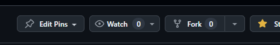
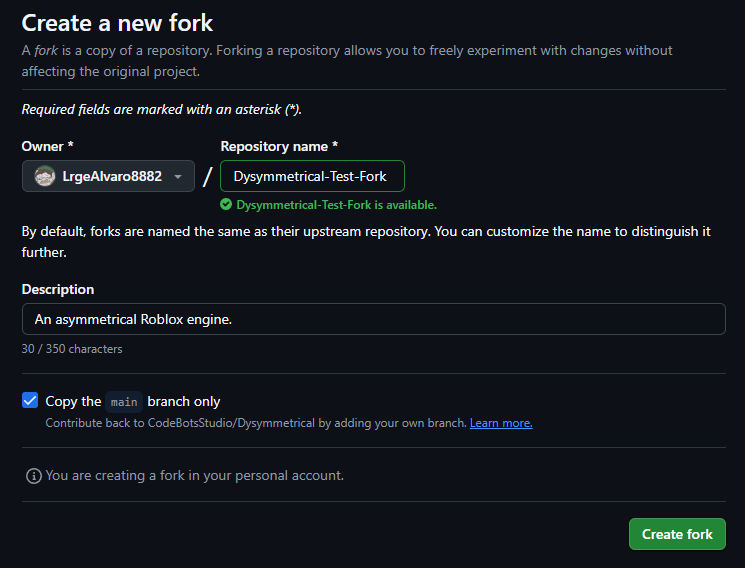
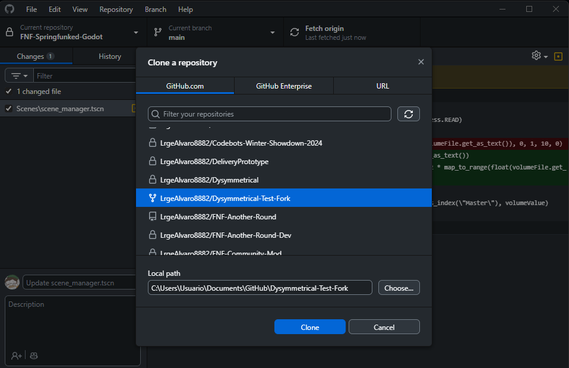
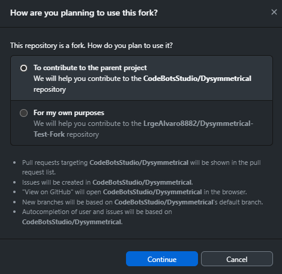
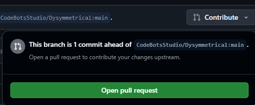
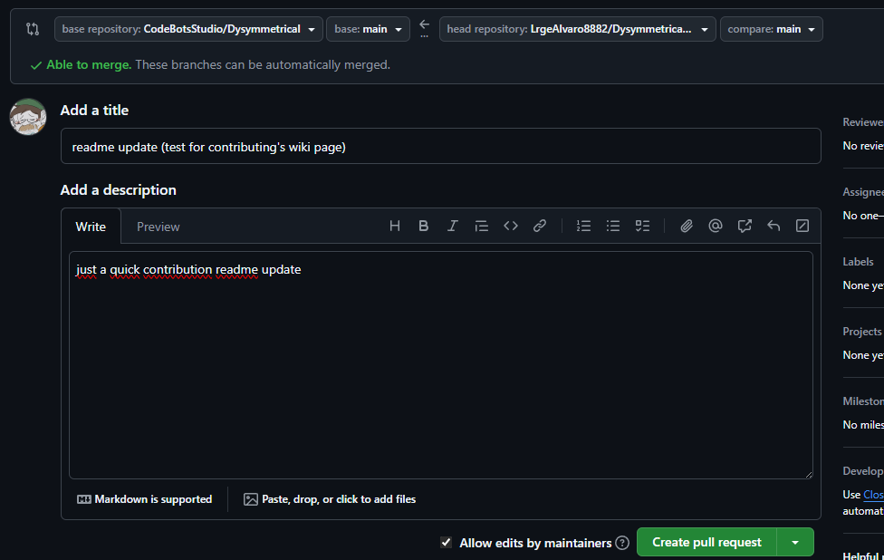

### Quick note

Read [Quick Note](https://github.com/CodeBotsStudio/Dysymmetrical/wiki/0.-Getting-Started#quick-note), [Required VSCode Extensions](https://github.com/CodeBotsStudio/Dysymmetrical/wiki/0.-Getting-Started#required-vscode-extensions) and [Recommended VSCode Extensions](https://github.com/CodeBotsStudio/Dysymmetrical/wiki/0.-Getting-Started#recommended-vscode-extensions) from [0. Getting Started](https://github.com/CodeBotsStudio/Dysymmetrical/wiki/0.-Getting-Started).

Also know that I'll refer to **Pull Requests** as **PRs**.

### Creating the PR's repository

First, go to [Dysymmetrical's repository](https://github.com/CodeBotsStudio/Dysymmetrical) and click the button labeled `Fork` at the top right.

Then, leave everything as is *except* for the name, that'll be named after a summary of 1-3 words of your changes (it can literally be named whatever you want but yeah).

In GitHub Desktop, clone the repository you just created in your local machine (PC) and open it with VSCode. Then, set it up like it says in [0. Getting Started](https://github.com/CodeBotsStudio/Dysymmetrical/wiki/0.-Getting-Started).

When you get prompted with what you'll use the fork for, indicate that it's for contributing to the parent project.

When you've done your changes and commits, go to your GitHub page and click `Contribute`, then `Open Pull Request`.

Name your PR and describe what you've done in its description, then hit `Create Pull Request`.

After this, your PR will be reviewed and maybe merged into the main branch. You'll also get a thank you. :>

When your PR has been closed, you can remove the PR's repository from your account if you want to.
