# DYSYMMETRICAL
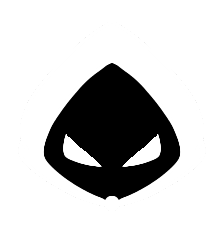
An asymmetrical game engine for Roblox.

## Features

#### Full documentation in most scripts
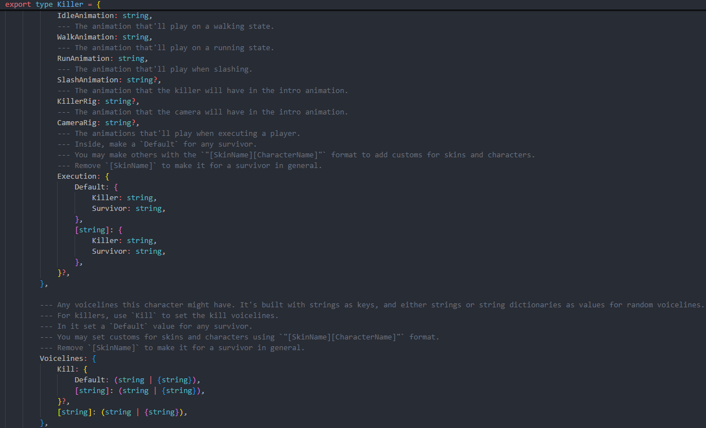
#### Easy UI Ordering in a single table
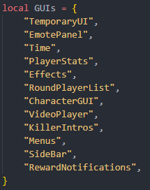
#### Simple character definitions & Templates for each role
For these templates, the animations will have to be replaced as the ones they have are owned by CodeBots.
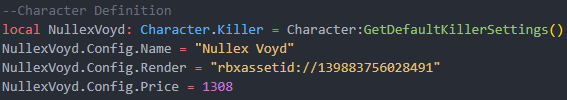

[...]

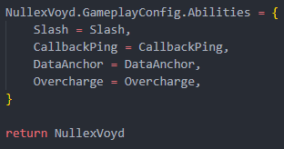
#### Pre-made customizable UI
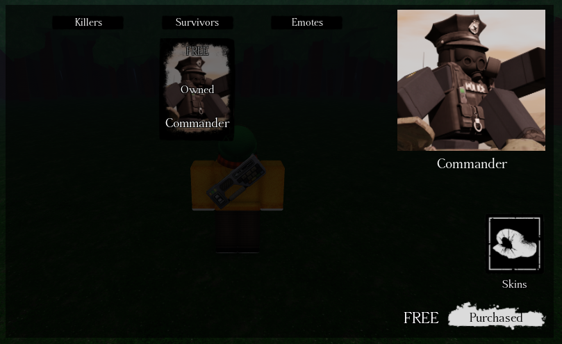
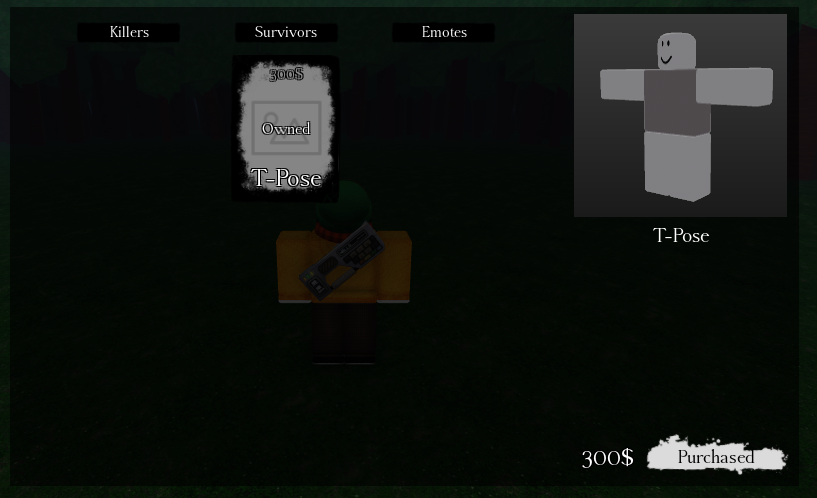
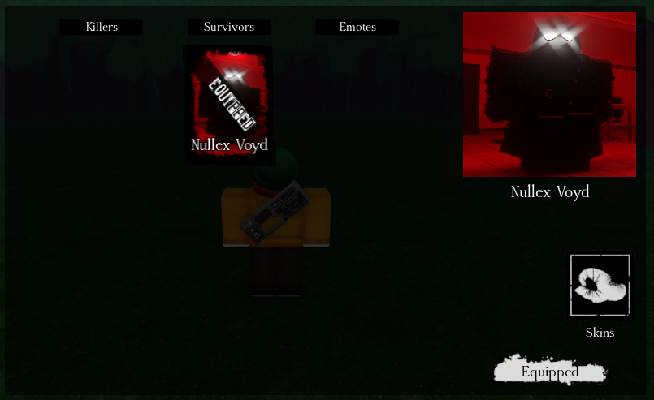
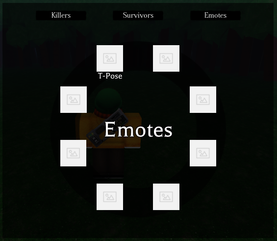
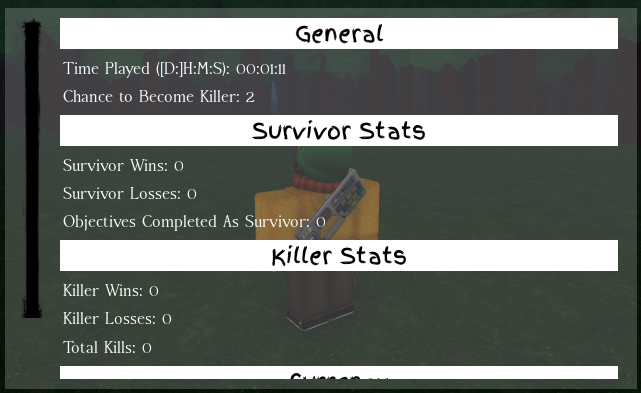
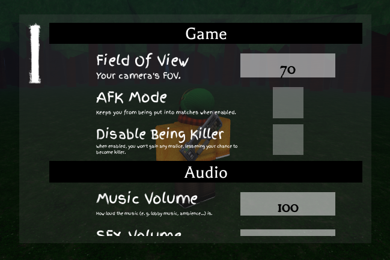
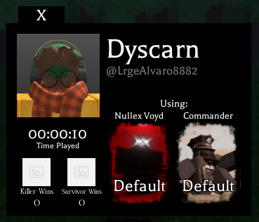

#### 1K+ lines of documented utils in ReplicatedStorage and ServerScriptService
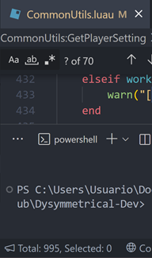
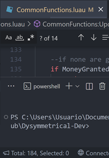

## DISCLAIMER
NO CODE or ESSENTIAL UI is being stolen from Forsaken.
There are certain assets from Forsaken used in this project's UI but they're nothing major and WILL be replaced soon.

## Getting Started
Read [Getting Started](https://github.com/CodeBotsStudio/Dysymmetrical/wiki/0.-Getting-Started) in the wiki.

## Bug reporting
If you find a certain bug in the engine, it'd be really appreciated if you reported it in the GitHub Issues page for this repo.

If you're able to fix it by yourself, it'd also be a great help if you opened a pull request fixing the issue.

Read `Contributing` below for more information.

## Documentation
Docs for anything added in the engine can be found through code comments at the start of important variables or functions. Any of those that isn't considered important outside of being used internally doesn't have any.

A proper docs page may be made if the project gets too big.

No one's stopping anyone from reading the code by themselves and changing it, though.

For animations, there are templates for Blender in `dysassets\Blend Files`.

## Contributing
Read [Contributing](https://github.com/CodeBotsStudio/Dysymmetrical/wiki/Contributing).

Any (fairly big) contributions made to the engine will be credited.

## Licensing
You may use this project for whatever you want, as long as you keep credit.
Do NOT remove the `print()` calls that identify this engine.
If you do, leave the engine credits in the game's description or in the credits menu in the lobby's sidebar.

Also see [MIT](https://github.com/CodeBotsStudio/Dysymmetrical/blob/main/LICENSE).

## Credits
Credits to [@PirosMacska](https://github.com/PirosMacska) for making the `VideoPlayer` module for 2D killer intros

Credits to [@grayzcale](https://github.com/grayzcale/simplepath) for the `SimplePath` module

## Pull Request credits

[@shroomii](https://github.com/shroomiii) in [#1](https://github.com/CodeBotsStudio/Dysymmetrical/pull/1) (clean .gitignore & GitHub Actions)
